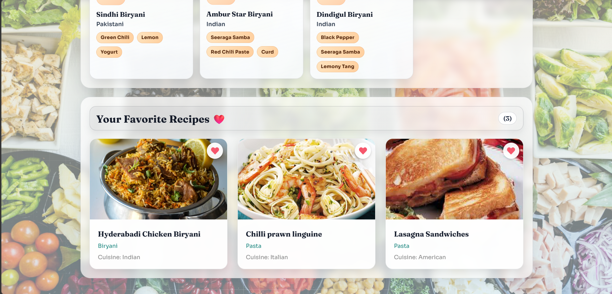

# ReciPick

ReciPick is a recipe discovery app built with React and Vite. Users can create an account, log in, explore recipes, filter by category, open full cooking details, and save favorites.

## Features

- Login and Sign Up page with localStorage session support
- Search recipes by name
- Filter recipes by category
- Special quick views for Biryani, Sri Lankan, and Indian dishes
- Recipe detail modal with ingredients, instructions, and video link
- Add and remove favorites
- Responsive design for desktop, tablet, and mobile

## Authentication

The app now includes an auth gate before entering the recipe dashboard:

- Sign Up creates a local account
- Login validates saved credentials
- Session is remembered with localStorage
- Logout is available inside the app

## Screenshot Section

Place screenshots in the screenshots folder using these filenames.

### Login Page


### Sign Up Page


### Home Dashboard


### Search Results


### Recipe Details Modal


### Favorites Page



### Mobile View


## Tech Stack

- React
- Vite
- Axios
- React Icons
- CSS

## Project Structure

```text
ReciPick/
  components/
    Favorite.jsx
    Filter.jsx
    Header.jsx
    RecipeCard.jsx
    RecipeDetail.jsx
    Searchbar.jsx
  Src/
    App.css
    App.jsx
    main.jsx
  screenshots/
  index.html
  package.json
  vite.config.js
```

## Getting Started

### 1. Install dependencies

```bash
npm install
```

### 2. Start development server

```bash
npm run dev
```

Open the URL shown in terminal, usually http://localhost:5173.

### 3. Build for production

```bash
npm run build
```

### 4. Preview production build

```bash
npm run preview
```

## API

This project uses TheMealDB API:

- Docs: https://www.themealdb.com/api.php
- Base URL: https://www.themealdb.com/api/json/v1/1/
- API Key: Not required for current endpoints

## Notes

- Favorites are stored in localStorage under the key favorites.
- Auth users are stored in localStorage under the key recipick-users.
- Current session is stored under recipick-session-user.
- Folder name is Src (capital S), keep imports consistent.

## License

This project is for learning and personal use.
